# Building UE4 Editor

this page will show you how to:
- get required tools for you development environment
- [clone Unreal Engine](#get-source-files) with the `HTML5 platform extension` branch
- [build Unreal Engine Editor](#compiling-ue4editor)
- [package BluePrint project](#package-a-sample-blueprint-project) (a small example, for your current desktop "target")
- [package C++ project](#package-a-sample-c-cpp-project) (for practice)

including the different ways Unreal Engine does packaging:
- [Package Project](#build-the-sample-blueprint-project)
- [Project Launcher](#project-launcher)
- [UnrealFrontEnd](#project-launcher-interface)
- Editor's [Launcher](#the-editors-launcher)

* * *
* * *
## Development Environment Requirements

please ensure you have the following tools downloaded and installed:

- [Git](https://git-scm.com/downloads)
	- Windows Note:
		- accept the default selected components
		- if you wish, change the editor preference (to your favorite)
		- personally, i `use Git from Git Bash only` (but, if you forsee yourself
		  using `git` from the **CommandPrompt** or **PowerShell**, then use the
		  `recommended` option)
		- accept all defaults (including `use MinTTY`) for the rest of the install
- [Python](https://www.python.org/downloads/) 2.7.12 or above
- [CMake](https://cmake.org/download/) 3.12 or above
	- Windows Note:
		- make sure to choose the option to add cmake to the `PATH` (local user or all users)
		- you will most likely need to log out and log back in to have this `PATH` updated

and, ensure you have the respective compiler tools for your desktop:

- Windows
	- [Visual Studio 2017](https://visualstudio.microsoft.com/vs/community/)

- Mac
	- [XCode 11](https://apps.apple.com/us/app/xcode/id497799835?mt=12)
	- TODO finish this list !!! "https://developer.apple.com/download/more/"

- Linux
	- build-essential


* * *
## Get Source Files

clone Unreal Engine (in this case, a fork of UE4 release 4.24 that has already
been branched with the HTML5 files populated in the `Unreal Engine platforms
extension` path).

in this example, clone to a folder named `ue4-r424-html5`

```
git clone -b 4.24-html5 --single-branch https://github.com/UnrealEngineHTML5/UnrealEngine ue4-r424-html5
```

remember, HTML5 is no longer an officially supported platform at Epic Games -- hence the `UnrealEngineHTML5` github account.

* * *
## Generate Project/Make Files

NOTE: due to the special branch that already has HTML5 platform files populated,
we are going to squeeze in calling `HTML5Setup.sh` here.

we will do an indepth explaination of [HTML5Setup.sh](README.1.emscripten.UE4.HTML5.md#html5setupsh-build-script)
in the next HowTo.

HEADS UP: the first time running this may take a while:
- `Setup.bat/Setup.command/Setup.sh` may take up to 20 minutes
- `HTML5Setup.sh` may take up to an hour or so
- `GenerateProjectFiles.bat/GenerateProjectFiles.command/GenerateProjectFiles.sh` may take up to 5 minutes


### on Windows

```
# open git-bash
# or, you can use "File Explorer" and right click on the
# "ue4-r424-html5" folder and select "Git Bash Here"
cd ue4-r424-html5
./Setup.bat

cd Engine/Platforms/HTML5
./HTML5Setup.sh
cd -

./GenerateProjectFiles.bat
# open the generated visual studio solution
```


### on Mac

```
# open a terminal to
cd ue4-r424-html5
./Setup.command

cd Engine/Platforms/HTML5
./HTML5Setup.sh
cd -

./GenerateProjectFiles.command
# open the generated xcode project
```


### on Linux

```
# open a terminal to
cd ue4-r424-html5
./Setup.sh

cd Engine/Platforms/HTML5
./HTML5Setup.sh
cd -

./GenerateProjectFiles.sh
```

### a note on (ENGINE) Setup.bat (Setup.command and Setup.sh)

this only needs to be run ONCE on your desktop.  it doesn't hurt if it is run
more than once (which might need to be done on newer Unreal Engine versions).

but, this is just a tip to save re-build times (or when trying to figure out
why your development environment is not working).


* * *
* * *
## Compiling Support Programs

### on Windows

after the visual studio solution is opened, i like to "manually rebuild" these support programs in the following order:

- in visual studio:
	- ensure **Solution Platform** is set to **Win64**

		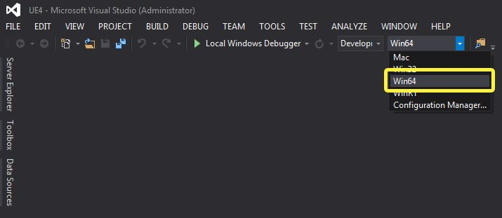

	- and **Solution Configuration** is set to **Development Editor**

		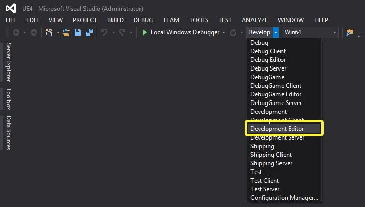

- in **Solution Explorer-> Solution -> Programs**, `right click select` and `build` the following (again, in this order):
	- AutomationTool
	- AutomationToolLauncher
	- UnrealBuildTool
	- UnrealHeaderTool
	- HTML5LaunchHelper (ok to skip, am working on figuring out why this may be missing)
	- ShaderCompileWorker
	- UnrealLightmass
	- UnrealPak
	- UnrealFileServer
	- UnrealFrontend (i normally like to build this particular one **after** building UE4Editor -- next section below...)

		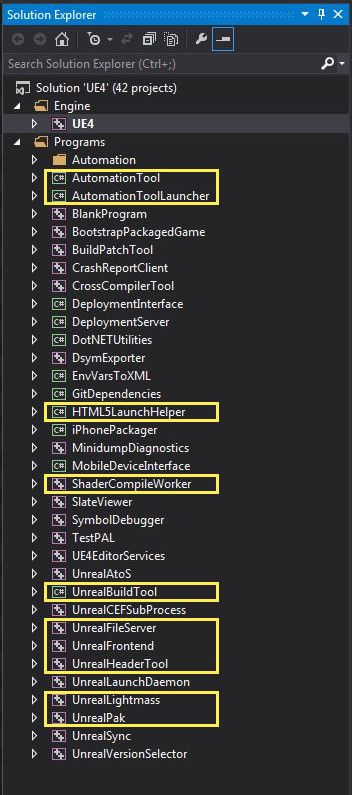


### on Mac

- open the XCode project and build the following (again, in this order):
	- TODO finish this list !!!


### on Linux

- from the same command prompt where `./GenerateProjectFiles.sh` was run above:
	- `make StandardSet`
	- note, this will also build UE4Editor
	- this will all take a while to complete...
		- goto Happy Hour


* * *
## Compiling UE4Editor

### on Windows

- `right click select` and `build` **Solution Explorer-> Solution -> Engine -> UE4**

	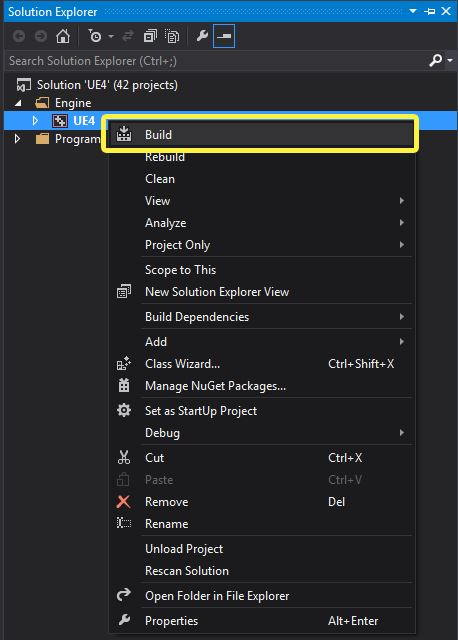

- this may take a while to complete (especially on the first build)
	- goto Lunch


### on Mac

- select UE4Editor, build !!! TODO find actual target name !!!

- this may take a while to complete (especially on the first build)
	- goto Farmers Market Cafe


### on Linux

- while this was already built above, use the following when making changes to UE4Editor:
	- `make UE4Editor`


* * *
* * *
## Run UE4Editor

when the build completes, fire up the Editor:
- note: i like to see the `stdout` prints (to know that the Editor is still running)
	- using `-log` parameter to view this

### on Windows

	...\Engine\Binaries\Win64\UE4Editor.exe -log

### on Mac

	.../Engine/Binaries/Mac/UE4Editor -log

### on Linux

	.../Engine/Binaries/Linux/UE4Editor -log


> if you see the **shaders building** -- let it run to completion -- this is usually a one time build.


* * *
* * *
## Package a Sample BluePrint Project

in Unreal parlance, "packaging" means:
- building the executable
- preparing (called "cooking") all graphic, audio assets and other data files
- and bundling everything together for the targeted platform


### Ensure Build Environment Is Working

#### ( Creating a Sample Blueprint Project )

let us start by creating a simple UE4 project targeted for your current desktop
computer.  this will check your build environment to see if it is working before
moving on to other platforms.

after opening UE4Editor (from [Run UE4Editor](#run-ue4editor) above):

- in the **Unreal Project Browser**

	- in **Select or Create a New Project**
		- click on `Games`, then **Next**
	
	- in **Select Template**
		- select (for example) `First Person`, then **Next**
	
	- in **Project Settings**
		- keep (for example) `Blueprint`, `Maximum Quality`, `Raytracing Disabled` and `Desktop/Console`
		- do change to `No Starter Content` (want to keep this project small for testing purposes)
		- select your `Folder` path and make up a project `Name`
			- e.g. let's call this project `BP_FP` (for blueprint first person)
	
	- finally, click **Create Project** button

		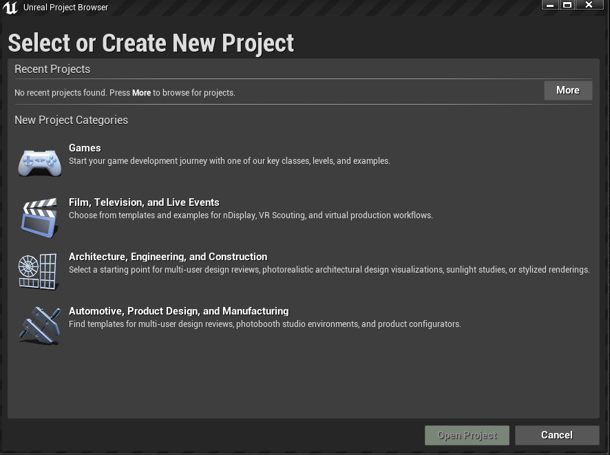


* * *
### Readying UE4Editor

when the Editor restarts, I like to have the following windows opened:

#### window #1

- Menu bar -> Window -> Developer Tools -> **Output Log**
	- you can tear the `output log` tab out of the box (for example) to another screen
	- the `output log` is where all prints are dumped
		- a must have when BugHunting packaging errors

		

#### window #2

- Menu bar -> Edit -> Project Settings ...

	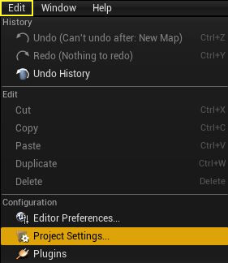

	- click around (and look around) the **Project Settings** categories and options for EVERYTHING (including the kitchen sink)
		- nothing needs to be changed here for now
		- just be aware this is where a lot of customization settings are found


* * *
### Build the Sample BluePrint Project

set the build type:

- Menu bar -> File -> **Package Project** -> Build Configuration
	- select `Development` (we are going to use the **game console** to **exit** the game below)
	- but, you can select `Shipping` when deploying for release

		

finally, package for your desktop:

- Menu bar -> File -> Package Project -> **Windows** or **Mac** or **Linux** (choose your desktop platform of choice)
	- select the folder where the final files will be **archived** to
		- **e.g.** on Windows: `D:\Builds\BP_FP\`
		- **e.g.** on Mac or Linux: `/ue4/Builds/BP_FP/`

	- this is going to take a while to complete...  especially if it's the first time building shaders too
		- go out for coffee


* * *
## Test Sample BluePrint Project

### on Windows via File Explorer

- open `File Explorer` to the location where files were **archived** to
	- e.g. `D:\Builds\BP_FP\WindowsNoEditor`
	- double click on `BP_FP.exe`


### on Mac via Finder

- open `Finder` to the location where files were **archived** to
	- e.g. `/ue4/Builds/BP_FP/MacNoEditor`
	- double click on `BP_FP`


### on Linux via File Manager

- open `File Manager` to the location where files were **archived** to
	- e.g. `/ue4/Builds/BP_FP/LinuxNoEditor`
	- double click on `BP_FP.sh`


### To Exit Game

- press `~` key
- type `exit` in the **console**
- hit enter/return key to quit game


* * *
* * *
## Package a Sample C++ (cpp) Project

for practice, let us try doing all of this again.  except this time, we are
going to use a C++ template project and use other packaging tools available
with Unreal Engine.


### Creating Sample C++ (cpp) Project

- [start up the Editor](#run-ue4editor) again if it is shutdown
	- in the **Unreal Project Browser**
	- in **Select or Create a New Project**
		- click on `Games`, then **Next**

- or, if your Editor is still running, you can select:
	- Menu bar -> File -> **New Project...**
		- in **Select Template Category**
			- click on `Games`, then **Next**

this time, we are gong to try a different project called: **Third Person**

- in **Select Template**
	- select (for example) `Third Person`, then **Next**
- in **Project Settings**
	- change "Blueprint" to `C++`
	- keep `Maximum Quality`, `Raytracing Disabled` and `Desktop/Console`
	- change to `No Starter Content` (want to keep this project small for testing purposes)
	- select your project `Folder` path and make up a project `Name`
		- e.g. let's call this project `CPP_TP` (for c++ third person)

> NOTE: we are going to use `CPP_TP` for the rest of this HowTo

close down the Editor -- we will restart it after building some (third person)
binary files that the Editor will load-in upon re-running it.


### Compile Sample C++ (cpp) "Editor" Files

(this is **an additional step** that needs to be done differently from the BluePrint only project.)

with the new C++ project created from the steps just above:

#### on Windows

- visual studio might be automatically started up
	- otherwise, double click on the **UE4.sln** to start visual studio up

- `right click select` and `build` **Solution Explorer-> Solution -> Games -> CPP_TP**
	- this will build the **project's Editor files**
	- note: this is not the same thing as the **project's runtime files**
		- we will do this later back in the Editor

#### on Mac

- double click on `UE4.xcworkspace`
- TODO find actual target name !!!

#### on Linux

```bash
# remember, the project `Folder` (and project `Name`) was set
# during the last step in "Creating Sample C++ (cpp) Project"
cd CPP_TP
make CPP_TP CPP_TPEditor
```

* * *
### Build Sample C++ (cpp) Project

restart the Editor with the project name appended
- note the use of `CPP_TP` here

##### on Windows

	...\Engine\Binaries\Win64\UE4Editor.exe CPP_TP -log

##### on Mac

	.../Engine/Binaries/Mac/UE4Editor CPP_TP -log

##### on Linux

	.../Engine/Binaries/Linux/UE4Editor CPP_TP -log


> TIP: put the command in a shortcut (or alias, script, etc.)


#### Plugins

for this example, to get you familiar with the **Plugins** features - open the
**Plugins** window and let's enable one item (that will be used in the next 2 HowTo's).
- Menu bar -> Edit -> Plugins ...

when the **Plugins** window open, in the `Search` box type **websocket**,
or you can find it in:

- Built-in -> Misc
	- **Experimental WebSocket Networking Plugin**

ensure that it is enabled (if the Editor asks you to restart, do so).

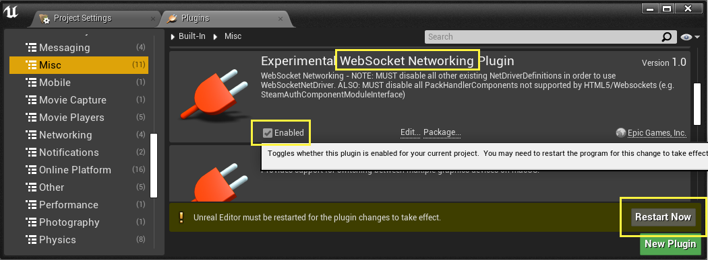


#### BEFORE:

Back in the Editor, we used the steps in [BluePrint example](#build-the-sample-blueprint-project)
to package from the Editor.

but now, let's try and use the other packaging tools available with Unreal Engine:
- **Project Launcher** and
- **UnrealFrontend** (think of this as a smaller version of `Editor` that **ONLY** does **packaging**)
	> NOTE: you should build from Editor **at least once** before using UnrealFrontend.
	the Editor will [setup configurations](#window-2) that are not done outside of Editor.


#### Project Launcher

from the `Editor`, open:
- Menu bar -> Window -> **Project Launcher**

	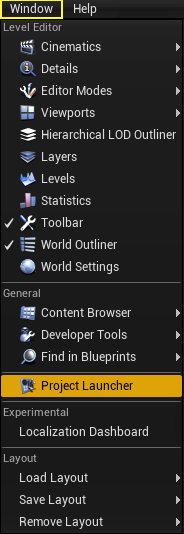

> to be continued in the [Project Launcher Interface](#project-launcher-interface) below.


#### UnrealFrontEnd

when, **UnrealFrontEnd** is used, it ALSO has the **Project Launcher** tab -- and
this is the **same** one we see from when opened from `Editor`.

to run **UnrealFrontEnd**:

##### on Windows

	...\Engine\Binaries\Win64\UnrealFrontend.exe

##### on Mac

	.../Engine/Binaries/Mac/UnrealFrontend
	TODO find actual target name !!!

##### on Linux

	.../Engine/Binaries/Linux/UnrealFrontend


#### Project Launcher Interface

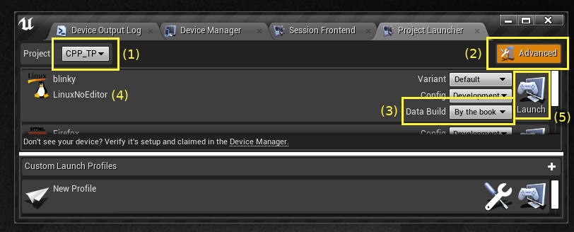

here, we've:
- set the **Project** to `CPP_TP` (1)
- enabled the `Advanced` button (2)
- set **Data Build** (which is the cooking type) to `By the book` (3)

to build the desktop game (4):
- on Windows, you will see `WindowsNoEditor`
- on Mac, you will see `MacNoEditor`
- on Linux, you will see `LinuxNoEditor`

click on the `Launch` button (5).

note: this will automatically run the game.  remember to exit the game by:
- press `~` key
- type `exit` in the **console**
- hit enter/return key to quit game

we will revisit this interface to build with `Custom Launch Profiles` in the
next HowTo page.


* * *
### Test Sample C++ (cpp) Project

#### The Editor's Launcher

there is (yet) another way to test your project.  artists and designers generally
like to use this option when testing their work.

- from the Editor's **Main Tool Bar**
- next to the **Launch** button
	- click on the **Advanced Options** (drop-down-arrow)

then, in the `Devices` menu:
- select the desktop you are using

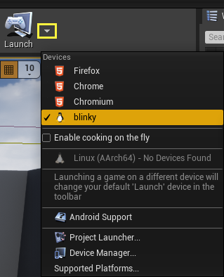

this will basically go through the same motion as **UnrealFrontEnd** did.
- the game will automatically run when build completes
- note: using this option (depending on the target platform) will perform what is known as cook-on-the-fly
	- the assets will be baked on a need-to-use basis
	- it doesn't go through the whole cook process, nor does it pak them
	- the assets are kept "loose"
	- this helps with faster art testing (i.e. quicker turn-around times)


#### Play In Editor

then, there is PIE (play-in-editor) which is the fast of all iteration types -- but,
these are usually better suited for level designers.

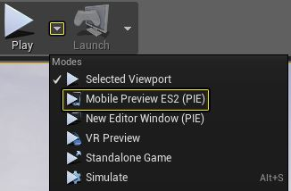

* * *

Next, [Emscripten and UE4](README.1.emscripten.UE4.HTML5.md)

* * *
